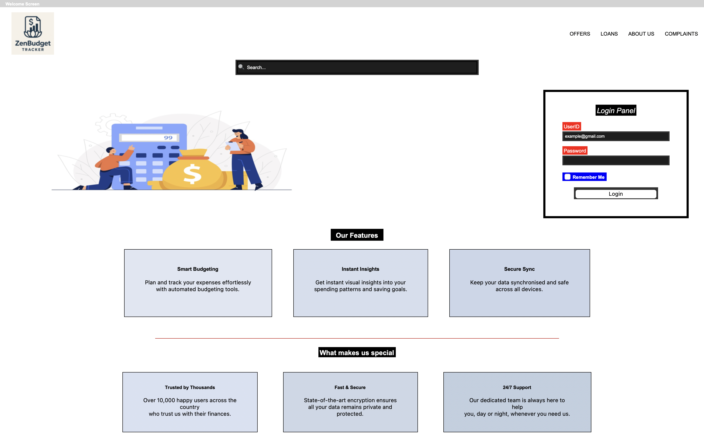

# Personal-Finance-Tracker-and-Categoriser
# Personal Finance Tracker and Categoriser

A personal finance management application developed for my A-Level Computer Science coursework. The project helps users record income and expenses, categorise transactions, monitor budgets, and view financial activity through a graphical interface.

## Features
- Add and manage financial transactions
- Categorise expenses and income
- Track monthly spending
- Monitor remaining budget
- View financial analytics
- Store transaction data
- Navigate between dashboard, transactions, analytics, budget, and help screens
- Input validation and error handling

## Screenshots
### Welcome Screen

